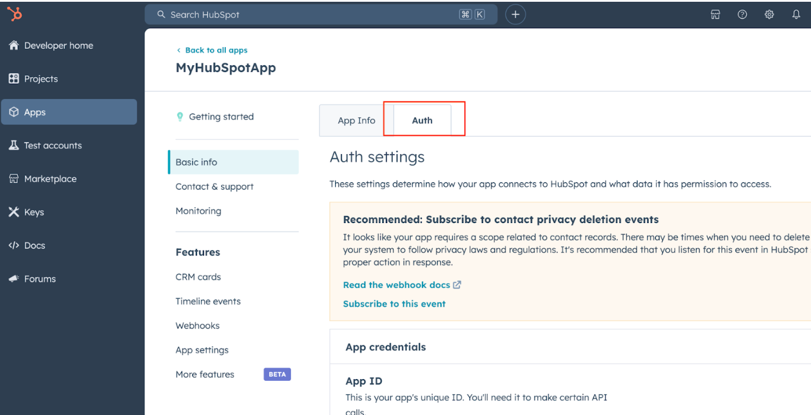
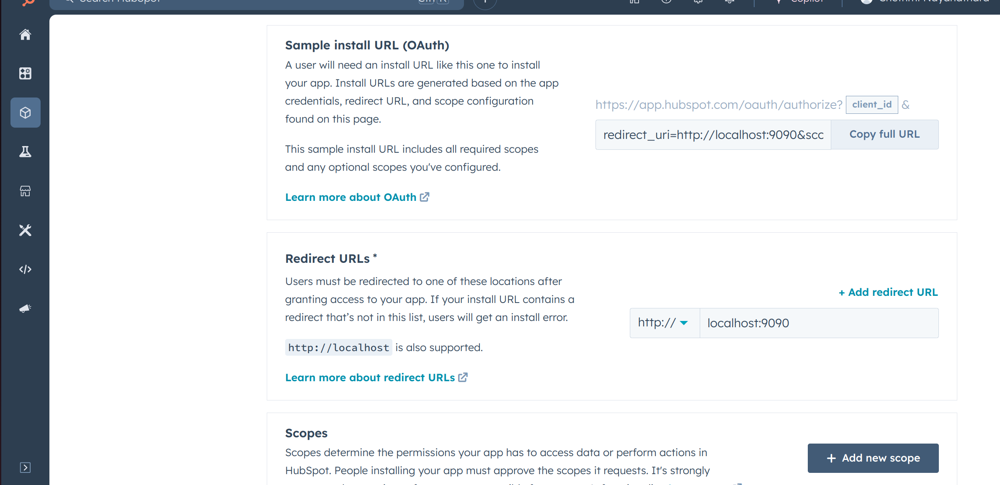

# Ballerina HubSpot CRM Object Tickets connector

[](https://github.com/ballerina-platform/module-ballerinax-hubspot.crm.object.tickets/actions/workflows/ci.yml)
[](https://github.com/ballerina-platform/module-ballerinax-hubspot.crm.object.tickets/actions/workflows/trivy-scan.yml)
[](https://github.com/ballerina-platform/module-ballerinax-hubspot.crm.object.tickets/actions/workflows/build-with-bal-test-graalvm.yml)
[](https://github.com/ballerina-platform/module-ballerinax-hubspot.crm.object.tickets/commits/master)
[](https://github.com/ballerina-platform/ballerina-library/labels/module%hubspot.crm.object.tickets)

## Overview

[//]: # (TODO: Add overview mentioning the purpose of the module, supported REST API versions, and other high-level details.)

[HubSpot](https://www.hubspot.com/our-story?_gl=1*1m7vzmd*_gcl_au*Njg4NDk3MzE4LjE3MzQ2NjYzMTk.*_ga*MTA3NDk2NDE4MC4xNzM0NDk5Njkx*_ga_LXTM6CQ0XK*MTczNDY2NjMxOS41LjEuMTczNDY2NjMyNS41NC4wLjA.*_fplc*cERXeW0zUkg1USUyRjhZTWNpcCUyQno5c3N6dEJmakNLeG5SJTJCUDQlMkZpR0xJbzlSMmlKMWdXMk1QNmd1NDluTzhIUUxVOGpTVFBac0x1OURSRnJuYTJzdnBYTE4wU3FVOHdGa2dUWUJQOVQxVlFKZlVOdVhRdHZYdlMlMkZTWUhhS0duZyUzRCUzRA..&_ga=2.223926171.1279200748.1734499691-1074964180.1734499691) is a customer relationship management (CRM) platform widely used in marketing, sales, customer service, and operations which provides a range of tools and software solutions designed to help businesses attract, engage, and retain customers. 

The ballerinax/hubspot.crm.object.tickets package offers APIs to create and manage CRM records that represent customer service requests in a CRM. The tickets endpoints allow you to manage create and manage ticket records, as well as sync ticket data between HubSpot and other systems, specifically based on HubSpot API v3.

## Setup guide

[//]: # (TODO: Add detailed steps to obtain credentials and configure the module.)
To use the `HubSpot CRM Object Tickets` connector, you must have access to the HubSpot API through a HubSpot developer account and an app under it. If you do not have a HubSpot developer account, you can sign up for one [here](https://developers.hubspot.com/get-started)

To obtain an authentication token for your HubSpot developer account, you can use OAuth for public apps. Here's a step-by-step guide for both methods:

Using OAuth for Public Apps:

OAuth is suitable for public apps intended to be used by multiple HubSpot accounts.

1. Create a Developer Account:
   * If you haven't already, register for a free [HubSpot developer account](https://developers.hubspot.com/get-started).

2. Create a [Developer test account](https://developers.hubspot.com/beta-docs/getting-started/account-types#developer-test-accounts)

3. Create a HubSpot App:
   * In your developer account, navigate to the "Apps" section.
   * Click on "Create App" and provide the necessary details, including the app name and description.

4. Initiate the OAuth Flow:
   * Move to the auth tab in the created app and set the permissions there.

   

   * Direct users to HubSpot's authorisation URL with the following query parameters:
client_id: Your app's Client ID.
redirect_uri: The URL users will be redirected to after granting access.
scope: A space-separated list of scopes your app is requesting.

   * Scope selection: 
Go to the relevate [API reference](https://developers.hubspot.com/beta-docs/reference/api),  select the API  you have  and go through the operation
You will see the scope has defined below way.

   
 
   * Now come back to your Auth page and add the relavant scopes using the add button.

   

5. Use the following Ballerina code and run it locally using the `bal run` command.

//Make URL to localhost port 9090

``` bash
import ballerina/http;
import ballerina/io;


service / on new http:Listener(9090) {
   resource function get .(http:Caller caller, http:Request req) returns error? {
       // Extract the "code" query parameter from the URL
       string? code = req.getQueryParamValue("code");


       if code is string {
           // Log the received code
           io:println("Authorization code received: " + code);
           // Respond to the client with the received code
           check caller->respond("Received code: " + code);
       } else {
           // Respond with an error message if no code is found
           check caller->respond("Authorization code not found.");
       }
   }
}
```
Gist reference : 
https://gist.github.com/lnash94/0af47bfcb7cc1e3d59e06364b3c86b59

6. Set up your redirect URL here as a local host.
      

7. Copy the sample installation URL and past it into a web browser.

Sample URL:
https://app.hubspot.com/oauth/authorize?client_id=YOUR_CLIENT_ID&scope=YOUR_SCOPES&redirect_uri=YOUR_REDIRECT_URI

8. Browser pop the HubSpost account and ask where to install the App then select your developer test account.

9. You will receive a code from there and it will be displayed on the browser.

10. Place ur code, client_id and client_screct  in to the correct place here,
```bash
curl --request POST \
  --url https://api.hubapi.com/oauth/v1/token \
  --header 'content-type: application/x-www-form-urlencoded' \
  --data 'grant_type=authorization_code&code=<code>&redirect_uri=http://localhost:9090&client_id=<client_id>&client_secret=<client_secret>'
```

Then execute this in terminal. If successful, you'll receive a JSON response containing access_token and refresh_token.

Where to place your refresh token, 
once you are going to initiate the generated client. 

```bash
OAuth2RefreshTokenGrantConfig auth = {
       clientId: <clientId>,
       clientSecret: <clientSecret>,
       refreshToken: <your refresh token>,
       credentialBearer: oauth2:POST_BODY_BEARER // this line should be added in to when you are going to create auth object.
   };
```


## Quickstart

[//]: # (TODO: Add a quickstart guide to demonstrate a basic functionality of the module, including sample code snippets.)

## Examples

The `HubSpot CRM Object Tickets` connector provides practical examples illustrating usage in various scenarios. Explore these [examples](https://github.com/module-ballerinax-hubspot.crm.object.tickets/tree/main/examples/), covering the following use cases:

[//]: # (TODO: Add examples)

## Build from the source

### Setting up the prerequisites

1. Download and install Java SE Development Kit (JDK) version 21. You can download it from either of the following sources:

    * [Oracle JDK](https://www.oracle.com/java/technologies/downloads/)
    * [OpenJDK](https://adoptium.net/)

   > **Note:** After installation, remember to set the `JAVA_HOME` environment variable to the directory where JDK was installed.

2. Download and install [Ballerina Swan Lake](https://ballerina.io/).

3. Download and install [Docker](https://www.docker.com/get-started).

   > **Note**: Ensure that the Docker daemon is running before executing any tests.

4. Export Github Personal access token with read package permissions as follows,

    ```bash
    export packageUser=<Username>
    export packagePAT=<Personal access token>
    ```

### Build options

Execute the commands below to build from the source.

1. To build the package:

   ```bash
   ./gradlew clean build
   ```

2. To run the tests:

   ```bash
   ./gradlew clean test
   ```

3. To build the without the tests:

   ```bash
   ./gradlew clean build -x test
   ```

4. To run tests against different environments:

   ```bash
   ./gradlew clean test -Pgroups=<Comma separated groups/test cases>
   ```

5. To debug the package with a remote debugger:

   ```bash
   ./gradlew clean build -Pdebug=<port>
   ```

6. To debug with the Ballerina language:

   ```bash
   ./gradlew clean build -PbalJavaDebug=<port>
   ```

7. Publish the generated artifacts to the local Ballerina Central repository:

    ```bash
    ./gradlew clean build -PpublishToLocalCentral=true
    ```

8. Publish the generated artifacts to the Ballerina Central repository:

   ```bash
   ./gradlew clean build -PpublishToCentral=true
   ```

## Contribute to Ballerina

As an open-source project, Ballerina welcomes contributions from the community.

For more information, go to the [contribution guidelines](https://github.com/ballerina-platform/ballerina-lang/blob/master/CONTRIBUTING.md).

## Code of conduct

All the contributors are encouraged to read the [Ballerina Code of Conduct](https://ballerina.io/code-of-conduct).

## Useful links

* For more information go to the [`hubspot.crm.object.tickets` package](https://central.ballerina.io/ballerinax/hubspot.crm.object.tickets/latest).
* For example demonstrations of the usage, go to [Ballerina By Examples](https://ballerina.io/learn/by-example/).
* Chat live with us via our [Discord server](https://discord.gg/ballerinalang).
* Post all technical questions on Stack Overflow with the [#ballerina](https://stackoverflow.com/questions/tagged/ballerina) tag.
