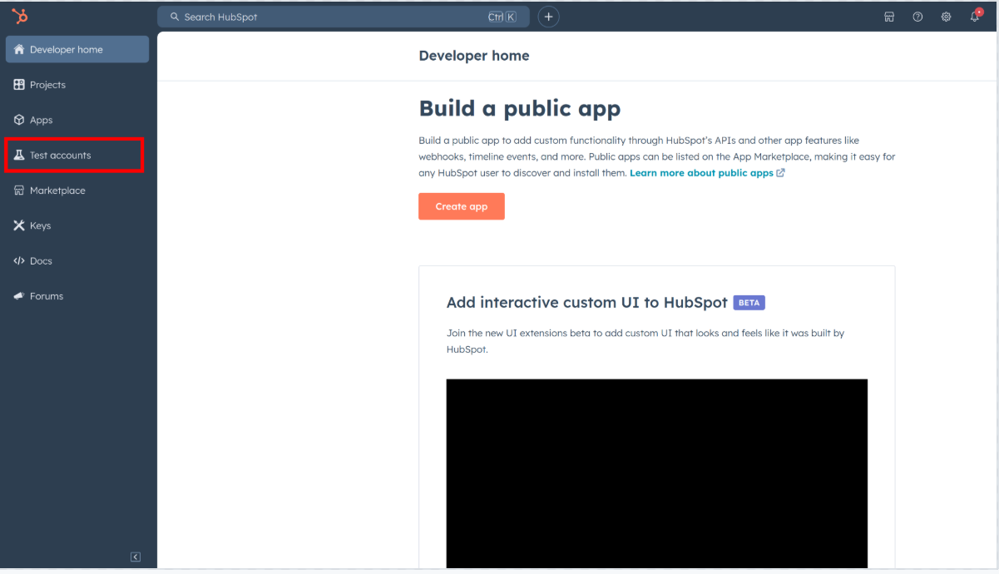
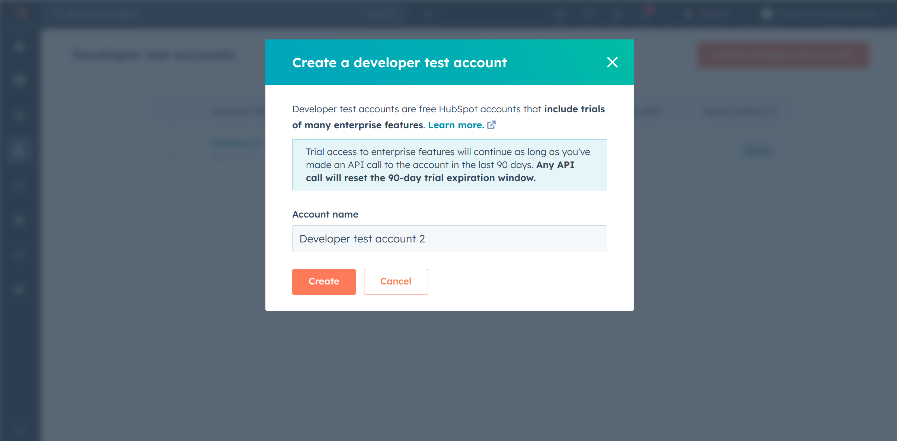
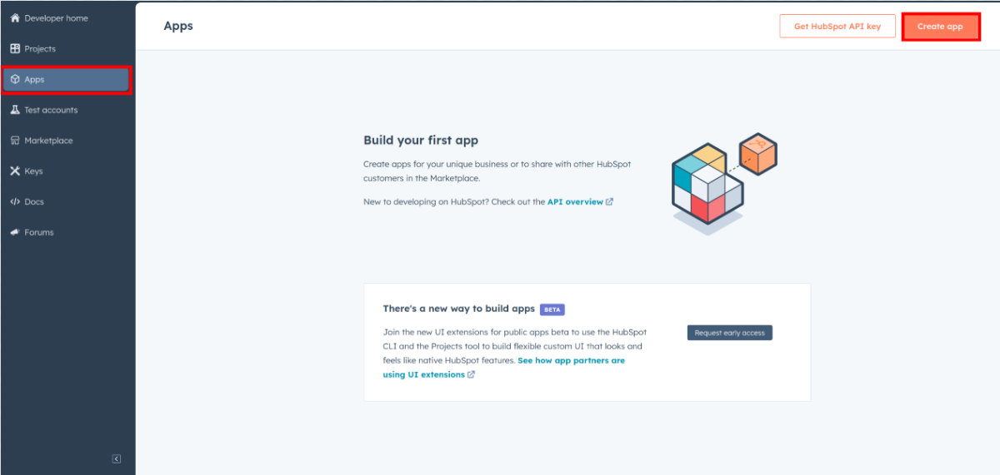

# Ballerina HubSpot CRM Object Tickets connector

[](https://github.com/ballerina-platform/module-ballerinax-hubspot.crm.object.tickets/actions/workflows/ci.yml)
[](https://github.com/ballerina-platform/module-ballerinax-hubspot.crm.object.tickets/actions/workflows/trivy-scan.yml)
[](https://github.com/ballerina-platform/module-ballerinax-hubspot.crm.object.tickets/actions/workflows/build-with-bal-test-graalvm.yml)
[](https://github.com/ballerina-platform/module-ballerinax-hubspot.crm.object.tickets/commits/master)
[](https://github.com/ballerina-platform/ballerina-library/labels/module%hubspot.crm.object.tickets)

## Overview

HubSpot is an AI-powered customer relationship management (CRM) platform. 

The `ballerinax/hubspot.crm.object.tickets` offers APIs to connect and interact with the [HubSpot Tickets API](https://developers.hubspot.com/docs/guides/api/crm/objects/tickets) endpoints, specifically based on the [HubSpot API v3](https://developers.hubspot.com/docs/reference/api).

## Setup guide

To use the `HubSpot CRM Object Tickets` connector, you must have access to the HubSpot API through a HubSpot developer account and an app under it. If you do not have a HubSpot developer account, you can sign up for one [here](https://developers.hubspot.com/get-started).

### Step 1: Create a HubSpot Developer Account

App Developer Accounts, allow you to create developer test accounts to test apps.

> **Note:** These accounts are only for development and testing purposes. Not to be used in production.

1. Go to "Test Account section" from the left sidebar.

    

2. Click "Create developer test account".

   

3. In the next dialogue box, give a name to your test account and click "Create".

   

### Step 2: Create a HubSpot App under your account.

1. In your developer account, navigate to the "Apps" section. Click on "Create App".
   

2. Provide the necessary details, including the app name and description.

### Step 3: Configure the Authentication Flow.

1. Move to the Auth Tab.

   

2. In the "Scopes" section, add the following scopes for your app using the "Add new scope" button.

   * `tickets`
   * `oath`

   

3. Add your Redirect URI in the relevant section. You can use `localhost` addresses for local development purposes. Then Click "Create App".

   

### Step 4: Get your Client ID and Client Secret

- Navigate to the "Auth" tab. Make sure to save the provided Client ID and Client Secret.

   

### Step 5: Setup Authentication Flow

Before proceeding with the Quickstart, ensure you have obtained the Access Token using the following steps:

1. Create an authorization URL using the following format:

   ```
   https://app.hubspot.com/oauth/authorize?client_id=<YOUR_CLIENT_ID>&scope=<YOUR_SCOPES>&redirect_uri=<YOUR_REDIRECT_URI>
   ```

   Replace the `<YOUR_CLIENT_ID>`, `<YOUR_REDIRECT_URI>` and `<YOUR_SCOPES>` with the above obtained values.

2. Paste it in the browser and select your developer test account to install the app when prompted.

3. A code will be displayed in the browser. Copy that code.


4. Run the following curl command. Replace the `<YOUR_CLIENT_ID>`, `<YOUR_REDIRECT_URI`> and `<YOUR_CLIENT_SECRET>` with your specific value. Use the code you received in the above step 3 as the `<CODE>`.

   - Linux/macOS

     ```bash
     curl --request POST \
     --url https://api.hubapi.com/oauth/v1/token \
     --header 'content-type: application/x-www-form-urlencoded' \
     --data 'grant_type=authorization_code&code=<CODE>&redirect_uri=<YOUR_REDIRECT_URI>&client_id=<YOUR_CLIENT_ID>&client_secret=<YOUR_CLIENT_SECRET>'
     ```

   - Windows

     ```bash
     curl --request POST ^
     --url https://api.hubapi.com/oauth/v1/token ^
     --header 'content-type: application/x-www-form-urlencoded' ^
     --data 'grant_type=authorization_code&code=<CODE>&redirect_uri=<YOUR_REDIRECT_URI>&client_id=<YOUR_CLIENT_ID>&client_secret=<YOUR_CLIENT_SECRET>'
     ```

   This command will return the access token necessary for API calls.

   ```json
   {
     "token_type": "bearer",
     "refresh_token": "<Refresh Token>",
     "access_token": "<Access Token>",
     "expires_in": 1800
   }
   ```

5. Store the access token and refresh token securely for use in your application.


## Quickstart

To use the `HubSpot CRM Object Tickets` connector in your Ballerina application, update the `.bal` file as follows:

### Step 1: Import the module

Import the `hubspot.crm.objects.tickets` module and `oauth2` module.

```ballerina
import ballerinax/hubspot.crm.object.tickets as hstickets;
import ballerina/oauth2;
```

### Step 2: Instantiate a new connector

1. Create a `Config.toml` file inside the Ballerina package and add the following configurations with the values retrieved in the earlier steps as follows:

   ```toml
    clientId = <Client Id>
    clientSecret = <Client Secret>
    refreshToken = <Refresh Token>
   ```

2. Instantiate a `OAuth2RefreshTokenGrantConfig` with the obtained credentials and initialize the connector with it.

    ```ballerina
   configurable string clientId = ?;
   configurable string clientSecret = ?;
   configurable string refreshToken = ?;

   OAuth2RefreshTokenGrantConfig auth = {
      clientId,
      clientSecret,
      refreshToken,
      credentialBearer: oauth2:POST_BODY_BEARER 
   };

   ConnectionConfig config = {auth};
   final Client HubSpotClient = check new Client(config);
   ```

Now, utilize the available connector operations. A sample usecase is shown below.

#### Create a New Ticket

```ballerina
public function main() returns error? {
    SimplePublicObjectInputForCreate payload = {
        properties: {
            "hs_pipeline": "0",
            "hs_pipeline_stage": "1",
            "hs_ticket_priority": "HIGH",
            "subject": "New troubleshoot report"
        }
    };
    SimplePublicObject response = check HubSpotClient->/crm/v3/objects/tickets.post(payload);
    io:println(response5);
    return;
}
```

## Examples

The `HubSpot CRM Object Tickets` connector provides practical examples illustrating usage in various scenarios. Explore these [examples](https://github.com/module-ballerinax-hubspot.crm.object.tickets/tree/main/examples/), covering the following use cases:


## Build from the source

### Setting up the prerequisites

1. Download and install Java SE Development Kit (JDK) version 21. You can download it from either of the following sources:

    * [Oracle JDK](https://www.oracle.com/java/technologies/downloads/)
    * [OpenJDK](https://adoptium.net/)

   > **Note:** After installation, remember to set the `JAVA_HOME` environment variable to the directory where JDK was installed.

2. Download and install [Ballerina Swan Lake](https://ballerina.io/).

3. Download and install [Docker](https://www.docker.com/get-started).

   > **Note**: Ensure that the Docker daemon is running before executing any tests.

4. Export Github Personal access token with read package permissions as follows,

    ```bash
    export packageUser=<Username>
    export packagePAT=<Personal access token>
    ```

### Build options

Execute the commands below to build from the source.

1. To build the package:

   ```bash
   ./gradlew clean build
   ```

2. To run the tests:

   ```bash
   ./gradlew clean test
   ```

3. To build the without the tests:

   ```bash
   ./gradlew clean build -x test
   ```

4. To run tests against different environments:

   ```bash
   ./gradlew clean test -Pgroups=<Comma separated groups/test cases>
   ```

5. To debug the package with a remote debugger:

   ```bash
   ./gradlew clean build -Pdebug=<port>
   ```

6. To debug with the Ballerina language:

   ```bash
   ./gradlew clean build -PbalJavaDebug=<port>
   ```

7. Publish the generated artifacts to the local Ballerina Central repository:

    ```bash
    ./gradlew clean build -PpublishToLocalCentral=true
    ```

8. Publish the generated artifacts to the Ballerina Central repository:

   ```bash
   ./gradlew clean build -PpublishToCentral=true
   ```

## Contribute to Ballerina

As an open-source project, Ballerina welcomes contributions from the community.

For more information, go to the [contribution guidelines](https://github.com/ballerina-platform/ballerina-lang/blob/master/CONTRIBUTING.md).

## Code of conduct

All the contributors are encouraged to read the [Ballerina Code of Conduct](https://ballerina.io/code-of-conduct).

## Useful links

* For more information go to the [`hubspot.crm.object.tickets` package](https://central.ballerina.io/ballerinax/hubspot.crm.object.tickets/latest).
* For example demonstrations of the usage, go to [Ballerina By Examples](https://ballerina.io/learn/by-example/).
* Chat live with us via our [Discord server](https://discord.gg/ballerinalang).
* Post all technical questions on Stack Overflow with the [#ballerina](https://stackoverflow.com/questions/tagged/ballerina) tag.
