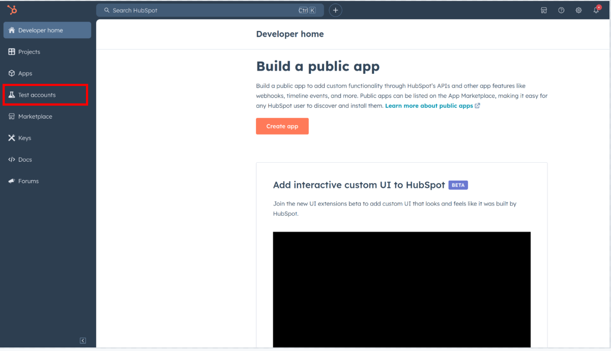
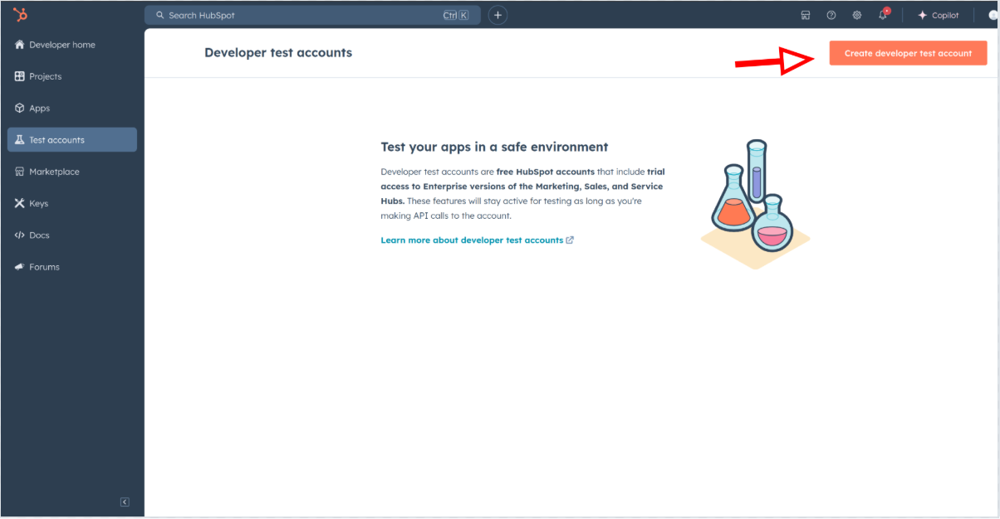
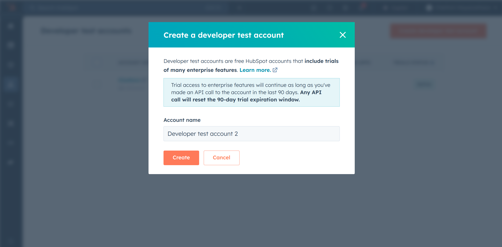
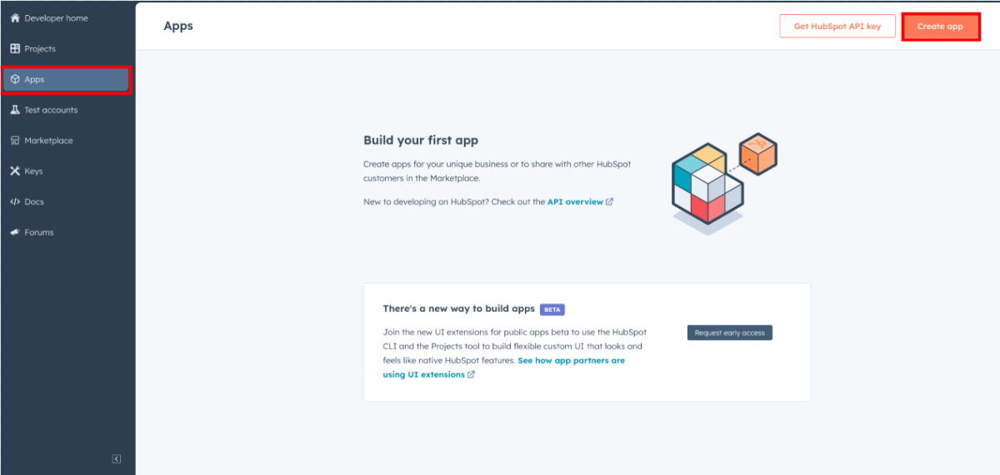
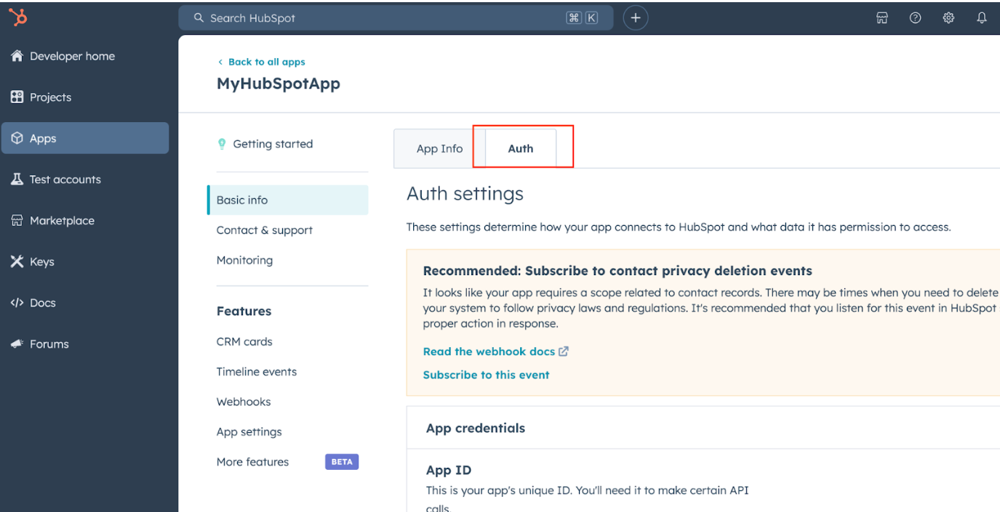
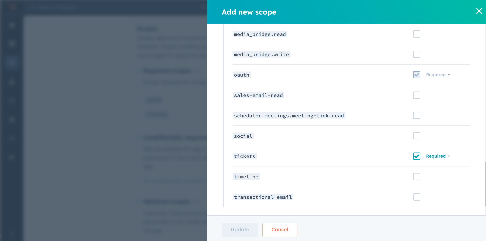
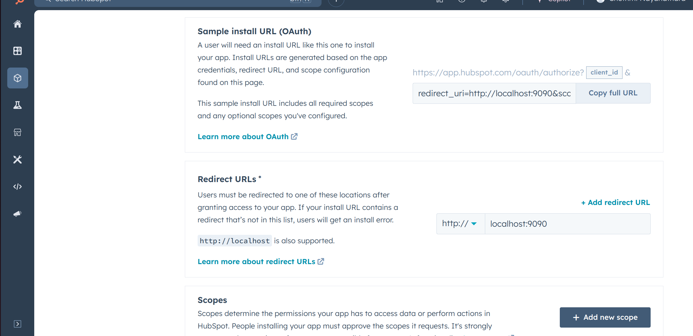
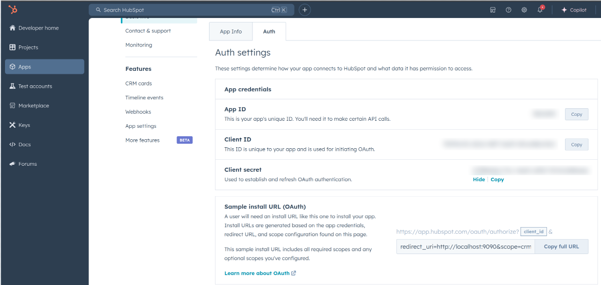

## Overview

HubSpot is an AI-powered customer relationship management (CRM) platform. 

The `ballerinax/hubspot.crm.object.tickets` offers APIs to connect and interact with the [HubSpot Tickets API](https://developers.hubspot.com/docs/guides/api/crm/objects/tickets) endpoints, specifically based on the [HubSpot API v3](https://developers.hubspot.com/docs/reference/api).

## Setup guide

To use the `HubSpot CRM Object Tickets` connector, you must have access to the HubSpot API through a HubSpot developer account and an app under it. If you do not have a HubSpot developer account, you can sign up for one [here](https://developers.hubspot.com/get-started).

### Step 1: Create a HubSpot Developer Account

App Developer Accounts, allow you to create developer test accounts to test apps.

> **Note:** These accounts are only for development and testing purposes. Not to be used in production.

1. Go to "Test Account section" from the left sidebar.

    

2. Click "Create developer test account".

   

3. In the next dialogue box, give a name to your test account and click "Create".

   

### Step 2: Create a HubSpot App under your account.

1. In your developer account, navigate to the "Apps" section. Click on "Create App".
   

2. Provide the necessary details, including the app name and description.

### Step 3: Configure the Authentication Flow.

1. Move to the Auth Tab.

   

2. In the "Scopes" section, add the following scopes for your app using the "Add new scope" button.

   * `tickets`
   * `oath`

   

3. Add your Redirect URI in the relevant section. You can use `localhost` addresses for local development purposes. Then Click "Create App".

   

### Step 4: Get your Client ID and Client Secret

- Navigate to the "Auth" tab. Make sure to save the provided Client ID and Client Secret.

   

### Step 5: Setup Authentication Flow

Before proceeding with the Quickstart, ensure you have obtained the Access Token using the following steps:

1. Create an authorization URL using the following format:

   ```
   https://app.hubspot.com/oauth/authorize?client_id=<YOUR_CLIENT_ID>&scope=<YOUR_SCOPES>&redirect_uri=<YOUR_REDIRECT_URI>
   ```

   Replace the `<YOUR_CLIENT_ID>`, `<YOUR_REDIRECT_URI>` and `<YOUR_SCOPES>` with the above obtained values.

2. Paste it in the browser and select your developer test account to install the app when prompted.

3. A code will be displayed in the browser. Copy that code.


4. Run the following curl command. Replace the `<YOUR_CLIENT_ID>`, `<YOUR_REDIRECT_URI`> and `<YOUR_CLIENT_SECRET>` with your specific value. Use the code you received in the above step 3 as the `<CODE>`.

   - Linux/macOS

     ```bash
     curl --request POST \
     --url https://api.hubapi.com/oauth/v1/token \
     --header 'content-type: application/x-www-form-urlencoded' \
     --data 'grant_type=authorization_code&code=<CODE>&redirect_uri=<YOUR_REDIRECT_URI>&client_id=<YOUR_CLIENT_ID>&client_secret=<YOUR_CLIENT_SECRET>'
     ```

   - Windows

     ```bash
     curl --request POST ^
     --url https://api.hubapi.com/oauth/v1/token ^
     --header 'content-type: application/x-www-form-urlencoded' ^
     --data 'grant_type=authorization_code&code=<CODE>&redirect_uri=<YOUR_REDIRECT_URI>&client_id=<YOUR_CLIENT_ID>&client_secret=<YOUR_CLIENT_SECRET>'
     ```

   This command will return the access token necessary for API calls.

   ```json
   {
     "token_type": "bearer",
     "refresh_token": "<Refresh Token>",
     "access_token": "<Access Token>",
     "expires_in": 1800
   }
   ```

5. Store the access token and refresh token securely for use in your application.


## Quickstart

To use the `HubSpot CRM Object Tickets` connector in your Ballerina application, update the `.bal` file as follows:

### Step 1: Import the module

Import the `hubspot.crm.objects.tickets` module and `oauth2` module.

```ballerina
import ballerinax/hubspot.crm.object.tickets as hstickets;
import ballerina/oauth2;
```

### Step 2: Instantiate a new connector

1. Create a `Config.toml` file inside the Ballerina package and add the following configurations with the values retrieved in the earlier steps as follows:

   ```toml
    clientId = <Client Id>
    clientSecret = <Client Secret>
    refreshToken = <Refresh Token>
   ```

2. Instantiate a `OAuth2RefreshTokenGrantConfig` with the obtained credentials and initialize the connector with it.

    ```ballerina
   configurable string clientId = ?;
   configurable string clientSecret = ?;
   configurable string refreshToken = ?;

   OAuth2RefreshTokenGrantConfig auth = {
      clientId,
      clientSecret,
      refreshToken,
      credentialBearer: oauth2:POST_BODY_BEARER 
   };

   ConnectionConfig config = {auth};
   final Client HubSpotClient = check new Client(config);
   ```

Now, utilize the available connector operations. A sample usecase is shown below.

#### Create a New Ticket

```ballerina
public function main() returns error? {
    SimplePublicObjectInputForCreate payload = {
        properties: {
            "hs_pipeline": "0",
            "hs_pipeline_stage": "1",
            "hs_ticket_priority": "HIGH",
            "subject": "New troubleshoot report"
        }
    };
    SimplePublicObject response = check HubSpotClient->/crm/v3/objects/tickets.post(payload);
    io:println(response5);
    return;
}
```

## Examples

The `HubSpot CRM Object Tickets` connector provides practical examples illustrating usage in various scenarios. Explore these [examples](https://github.com/module-ballerinax-hubspot.crm.object.tickets/tree/main/examples/), covering the following use cases:


